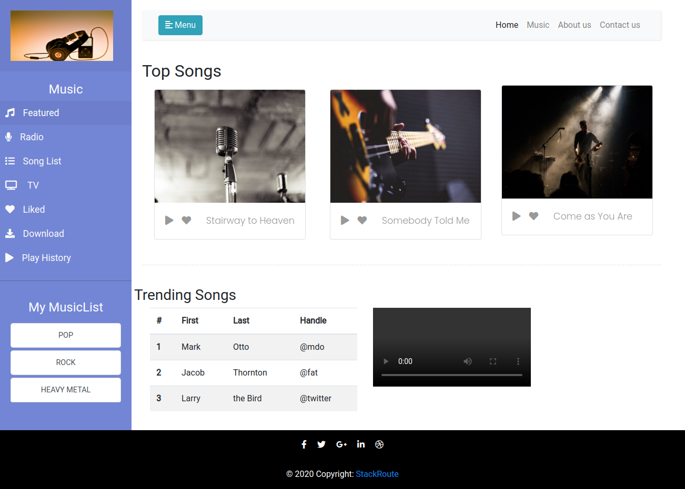

# Problem Statement

Create a Webpage for Music App.
For Reference screenshot is attached.

 Need to create similar layout of the webpage .

 Images is given in the folder you can use these images(Optional)

 **Need to host the webpage in github only.**

 ##  Instructions

  - Should  use of HTML5 Semantic such as Header, main,   section article tags.
  - Should  use  of Google Fonts
  - Page must have a Title, describing it's purpose /the name of the site.
  - Page must have a Navbar, Header and Footer.
  - Page must have Footer with social links and site links.  These links need not be functional.
  - Page must have Appropriate Descriptive Block Level Elements wherever feasible.
  

  ## CODING GUIDELINES

 -  The project repository must have a README.md describing about the project being done.
 - The project is suggested to have a descriptive folder structure.
 - The HTML code should adhere to W3C guidelines. Tags are closed, required attributes used, nothing deprecated, etc.
 - The code should make use of Meta Tags in narrating additional information like author and description of the page.
 - Comments should be included for things that may not be immediately obvious upon reviewing the code.
 - Two Space indentation must be followed while coding your page.
 - Usage of classes for elements which needs similar styling must be maximized.
 - Usage of Inline CSS should be eliminated.
 - Usage of External Stylesheet is recommended.
